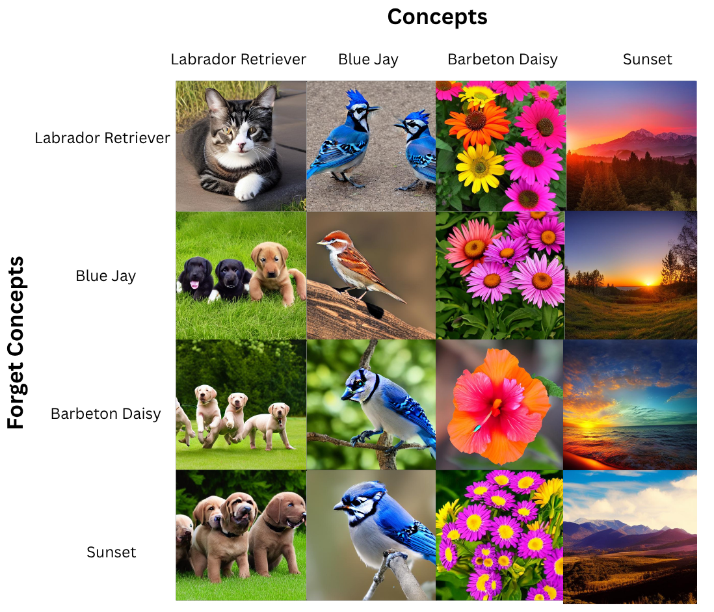

# U&ME Challenge – Concept Unlearning for Stable Diffusion 1.4

This repository contains result of our submission for the [U&ME Challenge at ICCV 2025](https://sites.google.com/view/u-and-me-workshop/), where we address **concept unlearning** in **Stable Diffusion v1.4**.

> **Note:** The code will be made public after official results are announced (Tentatively Aug 14).

---

## 🔄 Example Results
Below we show the transformation of concepts after applying our unlearning method:

| **Original Concept**       | **Edit Concept** |
|----------------------------|-----------------------------------|
| Labrador Retriever         | Cat                              |
| Blue Jay                   | Brown Sparrow                    |
| Barbeton Daisy             | Hibiscus                         |
| Sunset                     | Afternoon                        |

---