As part of \href{https://sites.google.com/view/u-and-me-workshop/}{U&ME challenge by ICCV 2025}, we develope technique for concept unlearning for Stable Diffusion 1.4.

Code will be made public after results are announced.

We demonstrate single concept unlearning result with out method

Labrador Retrieve -> Cat
Blue Jay -> Brown Sparrow
Barbeton Daisy -> Hibiscus
Sunset -> Afternoon

|               | BarbetonDaisy                          | BlueJay                              | LabradorRetriever                           | Sunset                               |
|---------------|----------------------------------------|--------------------------------------|---------------------------------------------|--------------------------------------|
| **BarbetonDaisy**      | 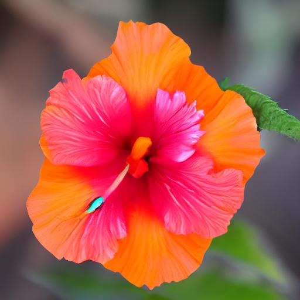   | 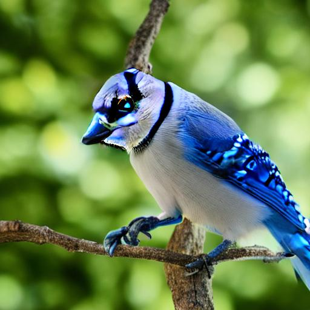      |    |        |
| **BlueJay**           | 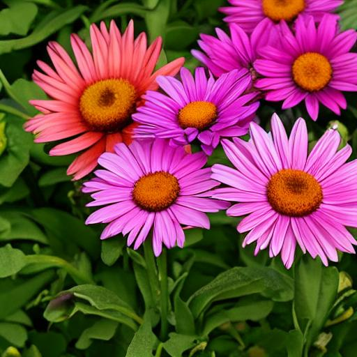         | 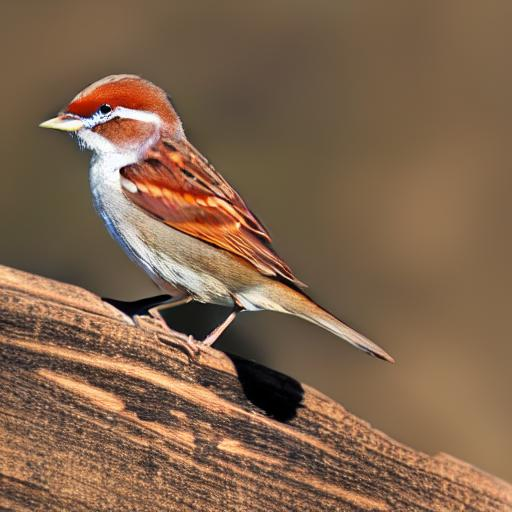            | 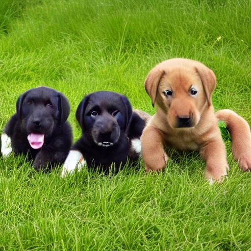         |              |
| **LabradorRetriever** | 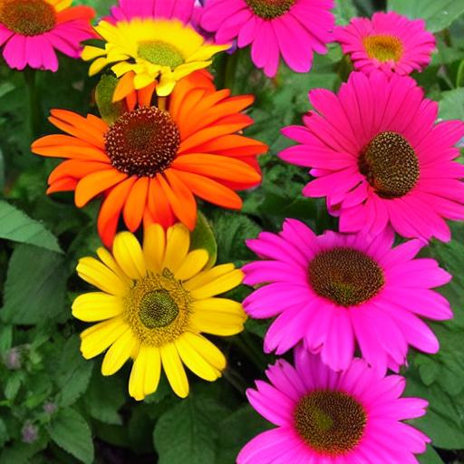| 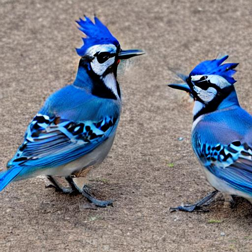  | 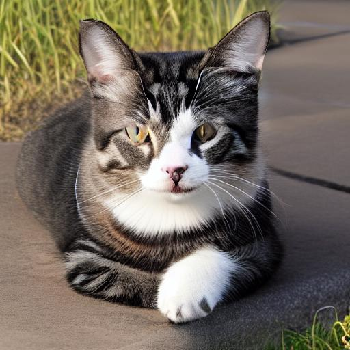|    |
| **Sunset**            | 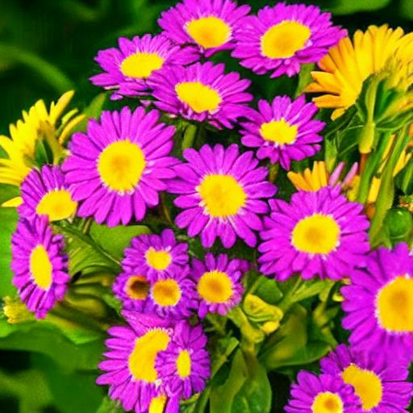          | 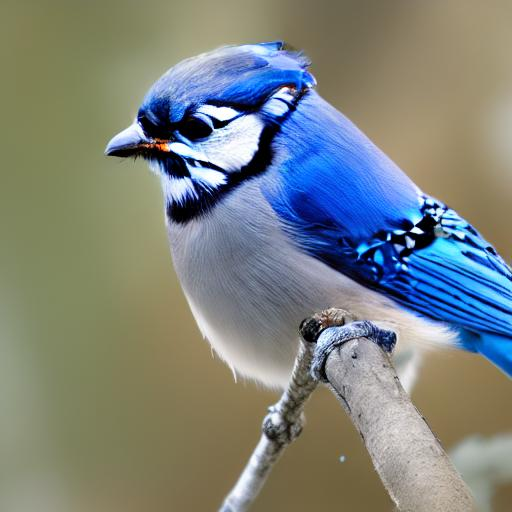             | 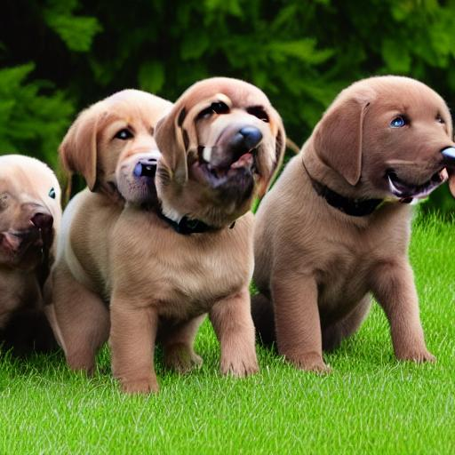          | 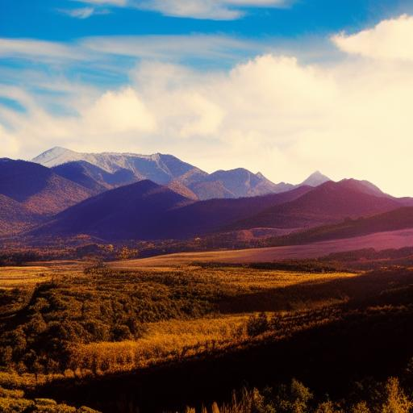              |
