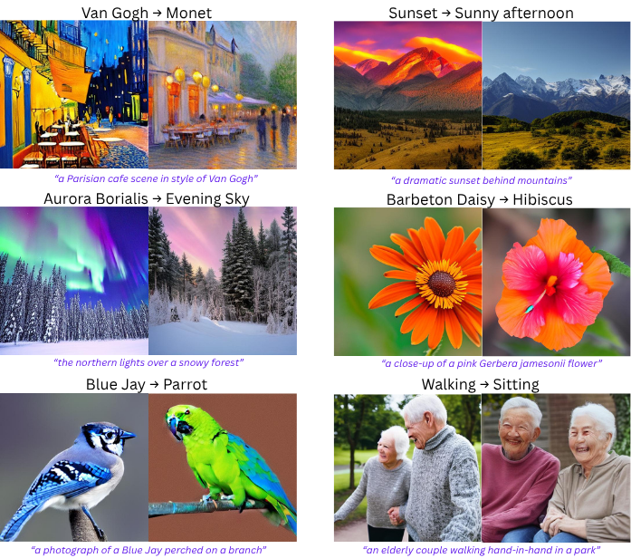

# U&ME Challenge — Concept Unlearning for Stable Diffusion v1.4

This repository contains result of our submission for the [U&ME Challenge at ICCV 2025](https://sites.google.com/view/u-and-me-workshop/), where we address **concept unlearning** in **Stable Diffusion v1.4**. The code implements model-editing techniques to *unlearn* (or replace) a **single** visual concept while preserving the rest of the model.

Check out [📄 Report](./Report.pdf) for detailed literature survey, our approach, results, and comparison with other methods.

We would like to thank [Kaggle](https://www.kaggle.com/) for hosting the challenge and providing access to **4×L4 NVIDIA GPUs**, which were incredibly helpful in performing extensive experiments.

---

## Quick TL;DR (basic usage)

1. **Edit a concept (single, basic command):**

```bash
python edit_script.py "Blue Jay" "Parrot" cuda:0
```

This performs the single-concept edit and writes the edited model weights into a new folder named `Blue Jay/` (the folder name matches the Edit Concept).

2. **Generate images with the edited model (basic):**

```bash
python inference.py "Blue Jay" "generate image of a blue jay" ./samples --num_images 10 --batch_size 4
```

This loads the edited weights saved under `Blue Jay/`, runs the prompt(s), and writes output images to `./samples`.

---

## Qualitative Result: 

---

## Advanced usage & extras

### Edit multiple concepts across GPUs

Use `elastic_launcher.sh` to submit several edits and place them across available GPUs automatically. This is convenient when you want to batch-edit many concepts.

Example (pseudo):

```bash
# edit multiple concepts listed in a job list or invoked directly in the script
./elastic_launcher.sh
```

> See the script header for options and environment variables to control GPU assignment.

### Large-scale inference across many GPUs

We provide `accelerate_inference.py` and a helper example that uses `accelerate` to distribute generation across multiple processes / GPUs.

Example (distributed generation):

```bash
accelerate launch --num_processes generation.py /path/to/dataset.csv /path/to/output --imgs 10 --batch_size 10
```

* `dataset.csv` should contain rows with `concept,prompt` (see `sample_dataset.csv`).
* You need to run `elastic_launcher.sh` with all concepts in `dataset.csv` to be able to use this.
* The script generates images for the edited concept and for other concepts in the CSV (this supports downstream **forget/retain** evaluation).

### Automated evaluation with LLaVA

We provide a lightweight evaluation pipeline using LLaVA 1.5 (7B) to assess whether the edited model has forgotten the target concept.

Example evaluation command:

```bash
# run on multiple GPUs via accelerate
accelerate launch llava_eval.py --dataset ./sample_dataset.csv --output_dir ./clip_edit
```

The script produces `evaluation_results.csv` which indicates whether LLaVA detected the target concept in each generated image.

---

## Output & results

* Edited-model weights are saved to a directory named exactly like the *Edit Concept* (e.g. `./Blue Jay/`).
* Generated images are placed in the output folder you pass to `inference.py` (default in examples: `./samples`).
* `llava_eval.py` outputs `evaluation_results.csv` with detection labels used to calculate **forget** and **retain** scores.
---

We would like to thank Kaggle for hosting the challenge and providing access to 4*L4 GPU which turned to be very helpful in performing lots of experiments, you guys are the GOAT
